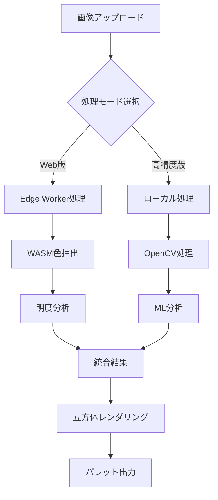

# 絵画支援パレット抽出ツール - 実装計画書（改訂版）

## エグゼクティブサマリー

デジタル絵画制作における色彩選択の課題を解決する専門ツール。参考画像から絵画制作に最適化された色パレットを抽出し、立方体アイソメトリック図による直感的な明暗構造の可視化を実現する。

### 差別化要素

- **絵画特化**: 写真的な色ではなく、絵画表現に適した色を抽出
- **視覚的理解**: 立方体による明暗構造の即座の把握
- **実用的連携**: 主要ペイントソフトへのシームレスな統合

## プロダクトビジョン

### ターゲットユーザー

1. **プライマリ**: デジタルアーティスト・イラストレーター
2. **セカンダリ**: コンセプトアーティスト・背景画家
3. **ターシャリ**: 美術学習者・カラーリスト

### ユーザーペインポイント

- 参考画像から絵画に適した色を選び出すのが困難
- 明暗関係の把握に時間がかかる
- ペイントソフトへの色データ移行が煩雑

## システムアーキテクチャ

### 技術スタック（改訂版）

```
┌─────────────────────────────────────────────┐
│              Frontend Layer                  │
│  Next.js 14 (App Router) + TypeScript       │
│  - React Server Components                  │
│  - Tailwind CSS + Radix UI                │
│  - Canvas API + WebGL (3D rendering)       │
└─────────────────────────────────────────────┘
                      ↓
┌─────────────────────────────────────────────┐
│             Edge Runtime Layer              │
│     Cloudflare Pages + Workers             │
│  - Image processing at edge                │
│  - WebAssembly for performance            │
│  - KV Storage for palette cache           │
└─────────────────────────────────────────────┘
                      ↓
┌─────────────────────────────────────────────┐
│          Advanced Processing Layer          │
│        Python + OpenCV (Optional)          │
│  - Machine Learning models                 │
│  - Advanced segmentation                   │
│  - Batch processing                        │
└─────────────────────────────────────────────┘
```

### データフロー設計



## 機能仕様（詳細版）

### Core Features

#### 1. インテリジェント画像入力

```typescript
interface ImageInputConfig {
  maxSize: 4096; // px
  formats: ['jpg', 'png', 'webp', 'heic'];
  colorSpace: 'sRGB' | 'DisplayP3';
  preprocessing: {
    autoRotate: boolean;
    colorProfileConversion: boolean;
    smartCrop: boolean; // AI被写体検出
  };
}
```

#### 2. 高度な領域選択

- **矩形選択**: 基本的なドラッグ選択
- **自由選択**: ペンツールによる輪郭描画
- **スマート選択**: 色類似度ベースの自動選択
- **マルチ領域**: 複数領域からの統合抽出

#### 3. 絵画最適化色抽出

```typescript
interface ExtractionConfig {
  algorithm: 'enhanced-kmeans' | 'octree' | 'neural-color';
  colorCount: { min: 5; max: 20; default: 12 };
  optimization: {
    removeNoise: boolean;
    mergeSimialar: boolean;
    enhanceContrast: boolean;
    paintingMode: 'oil' | 'watercolor' | 'digital' | 'anime';
  };
}
```

#### 4. 多次元色分析

```typescript
interface ColorAnalysis {
  luminance: {
    value: number; // 0-100
    category: 'highlight' | 'midtone' | 'shadow';
    distribution: number; // percentage in image
  };
  temperature: {
    kelvin: number;
    bias: 'warm' | 'cool' | 'neutral';
    strength: number; // 0-1
  };
  harmony: {
    type: 'complementary' | 'analogous' | 'triadic' | 'custom';
    relationships: ColorRelation[];
  };
  painting: {
    mixability: number; // 0-1, 混色のしやすさ
    opacity: 'opaque' | 'translucent' | 'transparent';
    pigmentSuggestion?: string; // 実際の顔料提案
  };
}
```

#### 5. インタラクティブ3D立方体

```typescript
interface IsometricCubeConfig {
  rendering: 'canvas2d' | 'webgl' | 'three.js';
  interaction: {
    rotation: boolean;
    zoom: boolean;
    colorPicking: boolean;
    animation: {
      entrance: 'fade' | 'build' | 'rotate';
      colorTransition: boolean;
    };
  };
  display: {
    size: { min: 200; max: 600; default: 400 };
    showGrid: boolean;
    showLabels: boolean;
    perspective: 'isometric' | 'perspective' | 'orthographic';
  };
}
```

### Advanced Features

#### 1. AIアシスト機能

- **被写体認識**: 主要オブジェクトの自動検出
- **スタイル分析**: 参考画像の画風判定
- **色調補正提案**: 絵画向け色調整の自動提案

#### 2. 色彩理論サポート

- **配色スキーム生成**: 抽出色から調和的な配色を生成
- **色相環表示**: インタラクティブな色相関係の可視化
- **混色シミュレーション**: デジタル/アナログ混色の予測

#### 3. プロジェクト管理

```typescript
interface ProjectFeatures {
  history: {
    maxItems: 50;
    persistence: 'local' | 'cloud';
    versioning: boolean;
  };
  collections: {
    createPaletteSet: boolean;
    tagging: boolean;
    sharing: 'private' | 'link' | 'public';
  };
  export: {
    batch: boolean;
    presets: PalettePreset[];
  };
}
```

## 実装アプローチ（改訂版）

### Phase 0: 技術検証とプロトタイプ（1週間）

#### 検証項目

1. **WebAssembly性能測定**
   - K-means実装のベンチマーク
   - メモリ使用量の最適化
   - Worker Threadでの並列処理

2. **3Dレンダリング比較**
   - Canvas 2D vs WebGL vs Three.js
   - パフォーマンス vs 機能性のトレードオフ

3. **色空間変換精度**
   - sRGB → LAB → sRGBの往復精度
   - ブラウザ間の色再現性

### Phase 1: MVP実装（3週間）

#### Week 1: 基盤構築

```typescript
// プロジェクト構造（詳細版）
painting-palette-tool/
├── app/
│   ├── (routes)/
│   │   ├── page.tsx                    # ランディング
│   │   ├── extract/page.tsx           # メイン機能
│   │   ├── gallery/page.tsx           # パレットギャラリー
│   │   └── api/
│   │       ├── extract/route.ts
│   │       ├── export/[format]/route.ts
│   │       └── share/route.ts
│   ├── components/
│   │   ├── ui/                        # 基本UIコンポーネント
│   │   ├── features/
│   │   │   ├── ImageCanvas/
│   │   │   ├── ColorExtractor/
│   │   │   ├── IsometricCube/
│   │   │   └── PaletteExporter/
│   │   └── layouts/
│   └── styles/
├── packages/
│   ├── color-engine/                  # 色処理コアライブラリ
│   │   ├── src/
│   │   ├── wasm/                     # WebAssembly実装
│   │   └── tests/
│   └── cube-renderer/                 # 3D描画ライブラリ
├── lib/
│   ├── utils/
│   ├── hooks/
│   └── constants/
└── tests/
    ├── e2e/
    ├── integration/
    └── unit/
```

#### Week 2: コア機能実装

- 画像処理パイプライン
- 色抽出エンジン（WASM版）
- 基本的な立方体表示

#### Week 3: UI/UX完成

- レスポンシブデザイン
- アニメーション実装
- エラーハンドリング

### Phase 2: 機能拡張（2週間）

#### Week 4: 高度な機能

- AI被写体検出
- 複数領域選択
- 色彩理論ツール

#### Week 5: 統合とエクスポート

- ペイントソフト連携
- プロジェクト管理
- 共有機能

### Phase 3: 最適化とスケーリング（1週間）

#### パフォーマンス最適化

```typescript
interface OptimizationTargets {
  imageProcessing: {
    target: '<500ms for 2MP image';
    strategy: ['WASM', 'Worker', 'Streaming'];
  };
  rendering: {
    target: '60fps cube rotation';
    strategy: ['WebGL', 'RequestAnimationFrame', 'CSS Transform'];
  };
  memory: {
    target: '<50MB for typical session';
    strategy: ['Lazy Loading', 'Image Compression', 'Garbage Collection'];
  };
}
```

## 品質保証戦略

### テスト戦略

```typescript
interface TestingPlan {
  unit: {
    coverage: 80;
    focus: ['Color algorithms', 'Data transformations'];
  };
  integration: {
    scenarios: ['Full extraction flow', 'Export formats'];
  };
  e2e: {
    tools: ['Playwright'];
    browsers: ['Chrome', 'Safari', 'Firefox'];
  };
  visual: {
    tools: ['Chromatic'];
    focus: ['Cube rendering', 'Color accuracy'];
  };
}
```

### アクセシビリティ

- **WCAG 2.1 AA準拠**
- **カラーブラインドモード**: 色の代替表現
- **キーボードナビゲーション**: 完全対応
- **スクリーンリーダー**: ARIA実装

## 運用とモニタリング

### 分析とメトリクス

```typescript
interface Analytics {
  technical: {
    performanceMetrics: ['LCP', 'FID', 'CLS'];
    errorRate: number;
    apiLatency: number;
  };
  usage: {
    extractionsPerDay: number;
    averageColorsExtracted: number;
    exportFormats: Record<string, number>;
  };
  user: {
    sessionDuration: number;
    featureAdoption: Record<string, number>;
    satisfactionScore: number;
  };
}
```

### デプロイメントパイプライン

```yaml
# .github/workflows/deploy.yml
stages:
  - test:
      - unit-tests
      - integration-tests
      - visual-regression
  - build:
      - next-build
      - wasm-compile
      - asset-optimization
  - deploy:
      - cloudflare-pages
      - edge-functions
      - cache-invalidation
```

## 収益化とビジネスモデル

### フリーミアムモデル

| Feature          | Free | Pro    | Team   |
| ---------------- | ---- | ------ | ------ |
| 月間抽出数       | 50   | 無制限 | 無制限 |
| 色数上限         | 12   | 20     | 20     |
| AI機能           | ✗    | ✓      | ✓      |
| プロジェクト保存 | 5    | 無制限 | 無制限 |
| チーム共有       | ✗    | ✗      | ✓      |
| API アクセス     | ✗    | ✓      | ✓      |
| 価格             | $0   | $9/月  | $29/月 |

## ロードマップ

### 2024 Q2

- MVP リリース
- 基本機能の安定化
- ユーザーフィードバック収集

### 2024 Q3

- AI機能統合
- モバイルアプリ開発
- プラグイン開発（Photoshop, Procreate）

### 2024 Q4

- エンタープライズ機能
- API公開
- 国際化対応

## リスク管理（詳細版）

### 技術リスクと軽減策

| リスク             | 影響度 | 発生確率 | 軽減策                       |
| ------------------ | ------ | -------- | ---------------------------- |
| WASM非対応ブラウザ | 高     | 低       | Pure JSフォールバック        |
| 色精度の不一致     | 中     | 中       | 厳密な色管理実装             |
| 大容量画像処理     | 高     | 中       | チャンク処理とストリーミング |
| エッジ関数の制限   | 中     | 高       | ハイブリッドアーキテクチャ   |

## 成功指標（KPI）

### 技術KPI

- **処理速度**: 2MP画像で500ms以内
- **精度**: 主観評価で85%以上の満足度
- **可用性**: 99.9%のアップタイム

### ビジネスKPI

- **MAU**: 6ヶ月で10,000ユーザー
- **コンバージョン率**: Free→Pro 5%
- **継続率**: 月次85%以上

### ユーザー体験KPI

- **NPS**: 50以上
- **タスク完了率**: 90%以上
- **平均セッション時間**: 5分以上

---

**次のステップ**: Phase 0の技術検証から開始し、各検証項目の結果を基にアーキテクチャの最終決定を行います。
